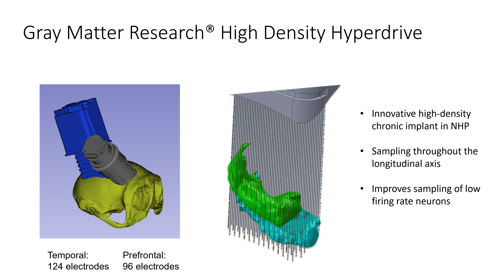

# Wisconsin Card Sorting Task
Meant to test working memory and executive function

## Task Description
* Task Parameters:
    - 4 items per trial
    - 12 dimensions divided in 3 groups: (shape, texture, color)
    - Monkey chooses by fixating on an item for 800 ms
    - After consistent success on a rule, the rule changes with no indication to the monkey that the rule has changed. Criterion is 8 correct trials in a row or 16/20 running average
* Task Timing and Details
    - Fixation cross turns on and the monkey needs to fixate for 500ms, choice is self-paced up to 4000 ms, 800ms fixation indicates choice, correct reward is 1500ms, incorrect time out is 5000 ms. Inter-trial interval is 400 ms
    - Reward is slurry of monkey chow–banana mixed with apple sauce
    - Reward is 7 pulses every 200 ms for 1400-1500 ms. First pulse starts immediately after the 800 ms fixation period. There is a beep with each pulse. Incorrect trials have no auditory feedback, there is just a 5000 ms time out 
800 ms fixation point isn’t the same spot–she needs to stay in the object for 800ms, but can have multiple fixation points on the item
    - Objects are randomly scattered on each trial with a guarantee of no overlap in the bounding box. Windows are all squares regardless of the shape of the item
    - During feedback, monkeys see a blank screen–all cards disappear

## Data Streams
* Subject Info: 9-year old female Rhesus macaque
* Eye tracking data:
    - Infrared eye tracker recording eye movements (probably PhaseSpace?)
    - Pupil tracking has position and diameter, but not sure if the stimuli are all brightness matched
* Neural data:
  
    - Microdrive with 100um independently moveable microwires
    - Two chambers, 124 electrodes in temporal areas, and 96 in prefrontal areas 
    - Lower drive, puncture dura in each location, and then lower drive in each location. Each rotation is 125microns–many rotations of the screwdriver. This is not done during the surgery. Prior to each recording, some small subset of electrodes are chosen to advance a bit further each day. 
    - Each recording day has the number of screw driver turns for each channel and we can use that to determine the advancement of each electrode into the brain
    - 220 channels, but not all of the channels were necessarily advanced in to the brain or some were dead 
    - Electrodes were advanced by area of interest and signal quality. We can look at recording locations overlaid on the monkey’s MRI and see if they were in cell-dense areas/layers
    - Interelectrode spacing is 150 microns
    - Electrodes stay in the brain, so unless the microdrive is pushed deeper, then the population of neurons should be similar
    - Sam had a lot of bone growth in the craniotomy, particularly for the frontal drive. There was calcification or granulation tissue, which might make the reconstruction of Sam’s electrode tracts difficult, and there was compression under the bone growth
    - Sam might have done a couple other tasks before this task. They probably weren’t as involved as this task 
    - Started the recordings from June 2018, and had been training on the task since January 2018
    - This was the first time she was implanted for this purpose
    - Neuralynx recording system, recorded a 30 kHz signal from each microwire and integrated behavioral events and eye signal–temporal alignment of all signals
Wideband signals are used to generate LFP and spikes
    - Spikes:
        - Obtained by high pass filter of 400 Hz
        - Threshold of 3.5 standard deviations below mean used to trigger spike waveform capture
        - Redraw spike window to be 8 timestamps before and 24 timestamps after the trough of each detected spike, with additional artifact rejection occurring before sorting
        - Some manual sorting using offline sorter, the rest were put through automated sorting–MountainSort algorithm. Uses template-based kilosort and IsoSplit sorting of MountainSort. This spits out a unit assignment for each spike and a noise cluster. These are run on individual electrodes, there’s simultaneous spikes that are compared across channels, but the threshold is about ⅔ of electrodes–more to catch artifacts
        - There’s a final curation step where all waveforms are pulled into OfflineSorter and then that is uploaded into the final version on S3 
        - File names with ‘a’ designate anterior drive 
        - 110 recordings worth
        - Units peaked at about 60 per session, and then dropped to 20 or so per session by the end of the experiment
    - LFP:
        - Target frequency of 1000 Hz is achieved by applying anti-aliasing and lowpass filter of 500 Hz, then downsampling
        - 60 Hz line noise is NOT removed at this stage
* Behavior:
    - Original file–left column is timestamp, right column is code. The code is trial start, etc. (23, 25, 27, 29) represent items appearing on the screen. Repeat of one of those (item 0 is the correct one in each trial and is represented by 23) is when the monkey’s gaze enters that item’s bounding box. 
    - Eye data also exist, but the raw data uploaded onto S3 has not been calibrated
    - Item position in the behavioral table is the center of the item in visual angles on the behavior screen
    - Extradimensional rule changes indicate that the monkey could be perseverating. Perseveration indicates when the monkey makes a choice but the choice overlaps with the previous rule
    - First rule is always the same–always Ripple, after each block, rule is chosen randomly. The balance between the intra- and extra-dimensional changes is maintained. 

test stinrg